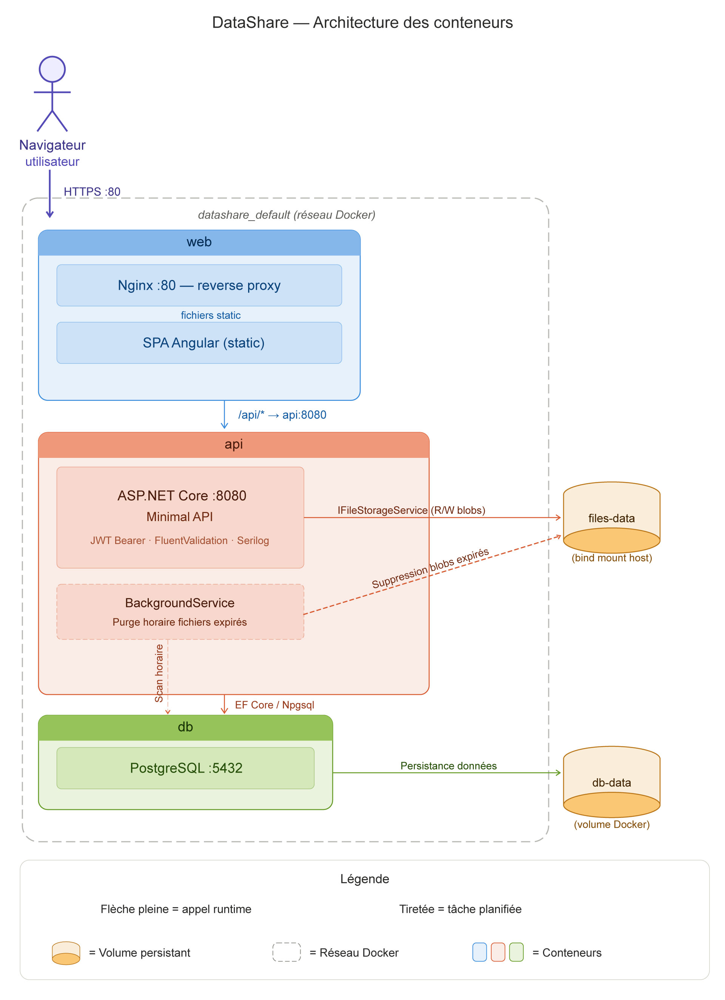
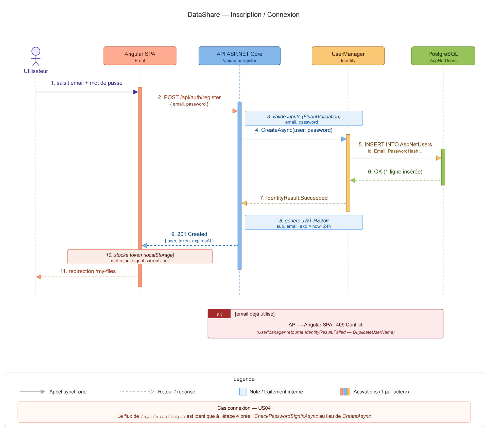
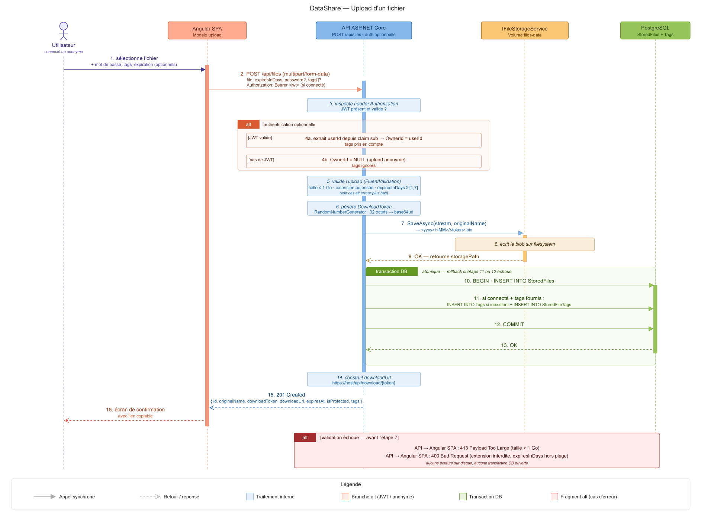
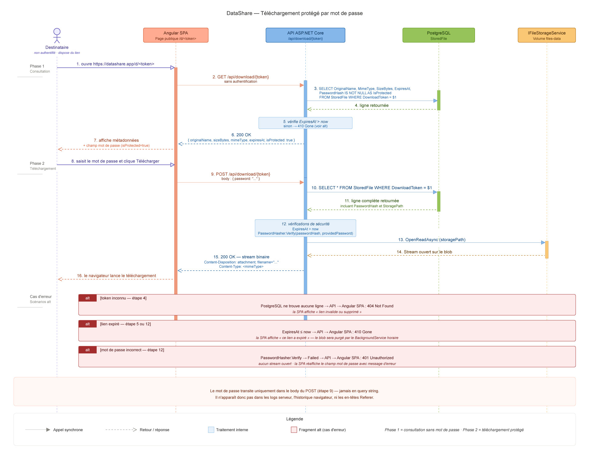
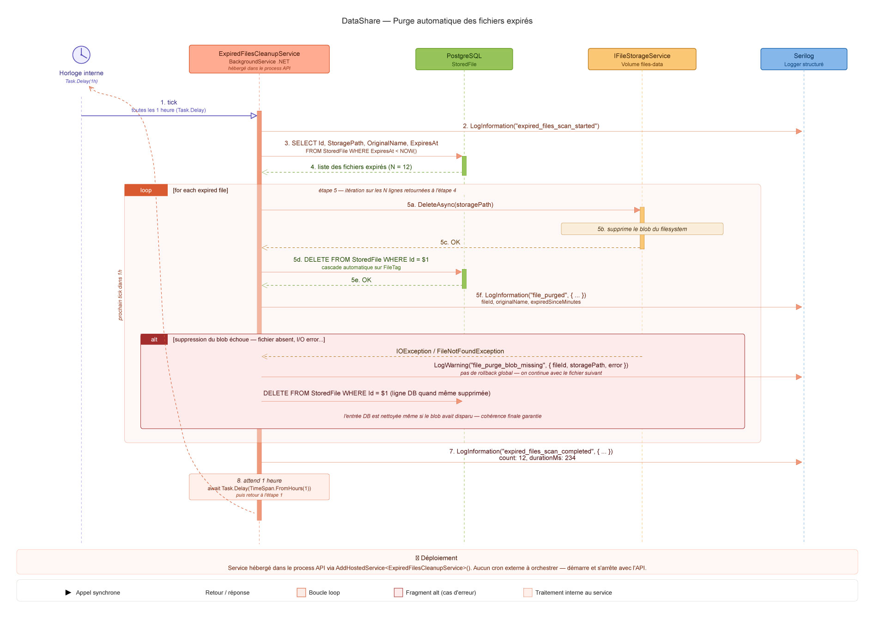

# DataShare — Architecture de la solution

> Ce document décrit l'architecture technique de DataShare. Pour le détail du modèle de données voir `02-modele-donnees.md`, pour le contrat d'API voir `api/openapi.yaml`.

## 1. Vue d'ensemble

DataShare est un MVP de plateforme de transfert de fichiers. L'utilisateur (connecté ou anonyme) téléverse un fichier, reçoit en retour un lien de téléchargement temporaire qu'il peut partager. Le destinataire accède au fichier via ce lien, éventuellement protégé par un mot de passe.

L'architecture est volontairement classique et conservatrice : **une SPA Angular** qui consomme une **API REST .NET 10** stateless, adossée à **PostgreSQL** pour les métadonnées et au **filesystem local** (monté en volume Docker) pour les blobs. L'ensemble est packagé en `docker-compose` pour qu'on puisse lancer la stack en une commande.

Le choix d'une SPA + API JSON sépare clairement les préoccupations : l'expérience utilisateur évolue indépendamment du back, et l'API reste exploitable par d'autres clients (mobile, CLI, intégrations) sans réécriture. Côté back, la **Clean Architecture en 4 projets** garantit qu'on peut faire évoluer la persistance (passer de filesystem à S3, ou changer de SGBD) sans toucher aux règles métier.

L'authentification est portée par **ASP.NET Identity**, avec délivrance d'un **JWT Bearer** valide 24 heures. Identity gère le hachage PBKDF2 + sel automatiquement. Toutes les routes protégées vérifient le token via le middleware standard `AddJwtBearer`.

L'expiration automatique des fichiers est gérée par un **`BackgroundService`** intégré au process API : toutes les heures, il exécute un cycle en **deux phases**. Phase 1 — pour chaque fichier dont `ExpiresAt` est dépassé, il supprime le blob du disque et marque la ligne comme purgée (`IsPurged = true`), ce qui la retire du téléchargement mais la laisse visible dans l'historique. Phase 2 — pour chaque ligne purgée depuis plus de 30 jours, il fait un hard-delete de la ligne `StoredFile` (cascade `FileTag` automatique). Pas de cron externe à orchestrer — un seul process à monitorer.

## 2. Diagramme de conteneurs



## 3. Composants

| Conteneur | Image | Port | Rôle | Dépendances |
|---|---|---|---|---|
| `web` | `nginx:alpine` (custom) | 80 | Sert la SPA Angular compilée et fait reverse proxy `/api/*` vers `api:8080` | `api` |
| `api` | `.NET 10 SDK → runtime` (multi-stage) | 8080 (interne) | Expose l'API REST, gère l'auth, le stockage et la purge | `db`, volume `files-data` |
| `db` | `postgres:16-alpine` | 5432 (interne) | Stocke les métadonnées (utilisateurs, fichiers, tags) | volume `db-data` |

**Volumes** :

| Volume | Type | Monté dans | Contenu |
|---|---|---|---|
| `db-data` | named volume | `db:/var/lib/postgresql/data` | Données PostgreSQL persistantes |
| `files-data` | bind mount sur host | `api:/var/datashare/files` | Blobs des fichiers téléversés |

**Réseau** : un seul réseau bridge Docker nommé explicitement `datashare` (cf. `docker-compose.yml`). En configuration par défaut, `web` expose le port 80 et `db` expose le port 5432 pour le développement local (accès direct depuis un client SQL). En production, le port 5432 doit être retiré du compose pour que seule la SPA soit accessible depuis l'extérieur.

## 4. Architecture interne du back-end (Clean Architecture)

Le back-end est découpé en **4 projets .NET** suivant les principes de la Clean Architecture, avec une orientation pragmatique adaptée à un MVP.

```
backend/
├── DataShare.Domain/          # Entités, interfaces, value objects, exceptions métier
├── DataShare.Application/     # Use cases, DTOs, validators, interfaces de services
├── DataShare.Infrastructure/  # EF Core, ASP.NET Identity, JWT, IFileStorageService impl
└── DataShare.Api/             # Minimal API endpoints, DI, middleware, Program.cs
```

**Règles de dépendance** (vérifiées en code review et idéalement par un test d'architecture type NetArchTest) :

- `Domain` : aucune dépendance externe — uniquement BCL
- `Application` : dépend de `Domain` uniquement
- `Infrastructure` : dépend de `Application` et `Domain`
- `Api` : dépend de tout (composition root)

**Bénéfices attendus** :

- Le code métier (validations, règles d'expiration, génération de token) est isolé dans `Domain`/`Application` et testable sans EF Core ni HTTP
- Pour passer du filesystem à S3, on ajoute une nouvelle implémentation de `IFileStorageService` dans `Infrastructure` sans toucher à `Application`
- Les endpoints Minimal API sont organisés par feature dans des extension methods (`MapAuthEndpoints`, `MapFileEndpoints`, `MapDownloadEndpoints`, `MapTagEndpoints`) — `Program.cs` reste lisible

## 5. Architecture interne du front-end

Application Angular 21 en **standalone components**, sans NgModule. Découpage par feature :

```
frontend/datashare-web/src/app/
├── core/                      # Services transverses (auth, http interceptor, guards)
│   ├── auth/                  # AuthService, JWT storage, AuthGuard
│   ├── interceptors/          # JWT interceptor, error interceptor
│   └── api/                   # Clients API typés
├── features/
│   ├── landing/               # Page d'accueil avec bouton upload central
│   ├── auth/                  # Login + register (modales)
│   ├── upload/                # Modale d'upload + écran de confirmation
│   ├── download/              # Page de téléchargement publique
│   └── my-files/              # "Mon espace" — historique + suppression + tags
├── shared/                    # Composants UI réutilisables (bouton, modal wrapper, etc.)
└── app.routes.ts              # Routing standalone
```

**État** : pas de Redux/NgRx pour un MVP. Les services Angular avec **signals** suffisent (`AuthService.currentUser` est un `WritableSignal<User | null>`). Les composants utilisent `OnPush` change detection par défaut.

**Style** : **Angular Material** (composants accessibles WCAG AA — exigence PSH des specs) + **Tailwind CSS** pour le custom (dégradé orange/corail des maquettes Figma, layout, espacements).

## 6. Communication front ↔ back

| Aspect | Choix |
|---|---|
| Protocole | HTTPS en prod, HTTP en local |
| Format | JSON pour les requêtes/réponses, multipart/form-data pour l'upload |
| Base URL | `/api` (relative — la SPA est servie depuis le même host que l'API via le reverse proxy nginx) |
| CORS | Configuré côté API pour `localhost:4200` (dev Angular) en plus du même origin |
| Authentification | JWT Bearer dans le header `Authorization` |
| Format d'erreur | `ErrorResponse { code, message, details? }` — voir `api/openapi.yaml` |
| Documentation interactive | Swagger UI exposée à `/swagger` en environnement Development |

**Côté Angular** :

- Un `HttpInterceptor` injecte automatiquement le token JWT dans toutes les requêtes vers `/api/*`
- Un second interceptor capture les `401` pour rediriger vers la page de login
- Un `AuthGuard` protège les routes connectées (`/my-files`)
- Le token est stocké dans `localStorage` (compromis simplicité MVP — pour la prod, voir note dans `SECURITY.md`)

## 7. Flux critiques

Quatre flux critiques sont documentés ci-dessous.

### 7.1 Inscription / connexion



1. L'utilisateur saisit email + mot de passe dans la modale de register/login
2. Angular envoie `POST /api/auth/register` (ou `/api/auth/login`)
3. L'API valide les inputs (DataAnnotations + `Validator.TryValidateObject`), passe par `UserManager` (Identity) pour créer/vérifier le user
4. Génération du JWT (claims : `sub` = userId, `email`, `jti`, `exp` = now + 24h) signé HS256
5. Réponse `{ user, token, expiresAt }`
6. Angular stocke le token et la `currentUser` signal, redirige vers `/my-files`

### 7.2 Upload



1. L'utilisateur sélectionne un fichier dans la modale d'upload, paramètre éventuellement mot de passe / expiration / tags
2. Angular envoie `POST /api/files` en multipart/form-data (avec JWT si connecté, sans si anonyme)
3. L'API vérifie l'authentification : si JWT présent → `OwnerId = userId` et tags pris en compte ; sinon → `OwnerId = null` et tags ignorés
4. L'API valide : taille ≤ 1 Go, extension autorisée, expiration ≤ 7 jours
5. Génération du `DownloadToken` : 32 octets aléatoires via `RandomNumberGenerator.GetBytes(32)`, encodés en base64url (43 caractères)
6. Stockage du blob dans le volume `files-data` via `IFileStorageService` (chemin = `<yyyy>/<MM>/<token>.bin`)
7. Insertion en base (`StoredFile` + `Tag`/`FileTag` si applicable) dans une transaction
8. Réponse `201 Created` avec `FileDto` complet (incluant `downloadUrl` construite)
9. Angular affiche l'écran de confirmation avec le lien copiable

### 7.3 Téléchargement protégé par mot de passe



1. Le destinataire ouvre l'URL de téléchargement dans son navigateur
2. Angular fait `GET /api/download/{token}` pour récupérer les métadonnées (`FileMetadataDto`)
3. Si `isProtected = true`, Angular affiche le champ mot de passe ; sinon, déclenche directement le téléchargement
4. L'utilisateur saisit le mot de passe et clique sur Télécharger
5. Angular envoie `POST /api/download/{token}` avec `{ password }` dans le body
6. L'API vérifie : token existe, non expiré, mot de passe correspond au hash
7. Si OK, l'API stream le contenu binaire avec `Content-Disposition: attachment; filename=<originalName>`
8. Si KO : `401 Unauthorized` (mauvais mot de passe), `404 Not Found` (token inconnu) ou `410 Gone` (expiré)

### 7.4 Expiration automatique



1. Un `BackgroundService` (`ExpiredFilesCleanupService`) tourne en continu dans le process API, intervalle `Task.Delay(TimeSpan.FromHours(1))`
2. **Phase 1 — purge des blobs** : sélection de `StoredFile` avec `ExpiresAt < NOW()` et `IsPurged = false`. Pour chaque ligne, suppression du blob via `IFileStorageService.DeleteAsync`, puis `IsPurged = true` et `StoragePath = ""` (la ligne reste visible dans l'historique utilisateur, flag `isPurged: true` côté DTO)
3. **Phase 2 — hard-delete** : sélection de `StoredFile` avec `IsPurged = true` et `ExpiresAt < NOW() - 30 jours` (via l'index composite `(IsPurged, ExpiresAt)`). Suppression définitive des lignes (cascade `FileTag`)
4. Logs Serilog : `file.purged` (phase 1, avec `FileId`, `OriginalName`, `expiredSinceMinutes`) et `file.hard_deleted` (phase 2)
5. En cas d'erreur sur un fichier (blob déjà supprimé, base verrouillée…), on log et on continue avec le suivant — pas de rollback global

## 8. Stockage des fichiers — choix et abstraction

Le MVP utilise un **stockage filesystem local** monté en volume Docker. Justification :

- **Coût zéro** : pas de compte AWS, pas de facturation à expliquer aux investisseurs
- **Démo simple** : il suffit de lancer la commande `docker compose up` et tout fonctionne, sans variables d'environnement secrètes
- **Suffisant pour l'échelle MVP** : un disque de quelques dizaines de Go absorbe largement les besoins de la démo

L'implémentation est cachée derrière une interface :

```csharp
public interface IFileStorageService
{
    Task<string> SaveAsync(Stream content, string fileName, CancellationToken ct);
    Task<Stream> OpenReadAsync(string storagePath, CancellationToken ct);
    Task DeleteAsync(string storagePath, CancellationToken ct);
}
```

Pour basculer en production vers AWS S3, MinIO, Azure Blob ou n'importe quel autre stockage objet, il suffit d'ajouter une nouvelle implémentation dans `DataShare.Infrastructure` (`S3FileStorageService`) et d'enregistrer la bonne implémentation dans le conteneur DI selon une variable de configuration. Aucun changement dans la couche `Application` ni dans les endpoints.

## 9. Observabilité et logs

- **Serilog** configuré dès le démarrage (`Program.cs`) avec sink console en JSON structuré
- Niveau par défaut : `Information` ; rabaissé à `Warning` pour `Microsoft.*` et `System.*` pour réduire le bruit
- Enrichissements : `MachineName`, `EnvironmentName`, `CorrelationId` (middleware)
- Événements clés tracés : `auth.login.success`, `auth.login.failure`, `file.uploaded`, `file.downloaded`, `file.deleted`, `file.purged`, `error.unhandled`

Détails sur les métriques et le suivi de performance dans [`PERF.md`](../PERF.md).

## 10. Sécurité — synthèse

Détails et plan d'action complet dans [`SECURITY.md`](../SECURITY.md). En synthèse, ce qui est en place dès le MVP :

- Hash des mots de passe comptes : PBKDF2 + HMAC-SHA256 (défaut ASP.NET Identity)
- Hash des mots de passe fichier : BCrypt (BCrypt.Net-Next, cost factor 11)
- JWT signé HS256, secret en variable d'environnement (jamais en clair dans le code)
- Validation client + serveur sur tous les inputs (DataAnnotations + `Validator.TryValidateObject` côté API, Reactive Forms côté Angular)
- Vérification d'ownership systématique sur DELETE et historique — anti-IDOR par réponse 404 indiscernable
- Rate limiter partitionné par IP (10 uploads/min, 20 downloads/min)
- Tokens de téléchargement non prédictibles (32 octets entropy, base64url)
- Mot de passe fichier : envoyé en POST body, jamais en query string
- Extensions de fichiers interdites filtrées à l'upload
- Cascade DB sur suppression pour éviter les orphelins

## 11. Hors-scope MVP — évolutions identifiées

Listées explicitement pour anticiper les questions et alimenter [`MAINTENANCE.md`](../MAINTENANCE.md) :

- Refresh tokens (actuel : access token 24h sans renouvellement)
- Stockage objet distribué (S3/MinIO) — l'abstraction est en place, l'implémentation reste à écrire
- Antivirus à l'upload (ClamAV ou équivalent)
- Email de confirmation à l'inscription
- Métriques Prometheus / dashboard Grafana
- Authentification à double facteur (2FA / TOTP) — ASP.NET Identity le supporte nativement
- Notifications (webhook ou email) à l'upload, à l'expiration imminente
- HTTPS + HTTP/2 + Brotli (nécessite certificat TLS)
