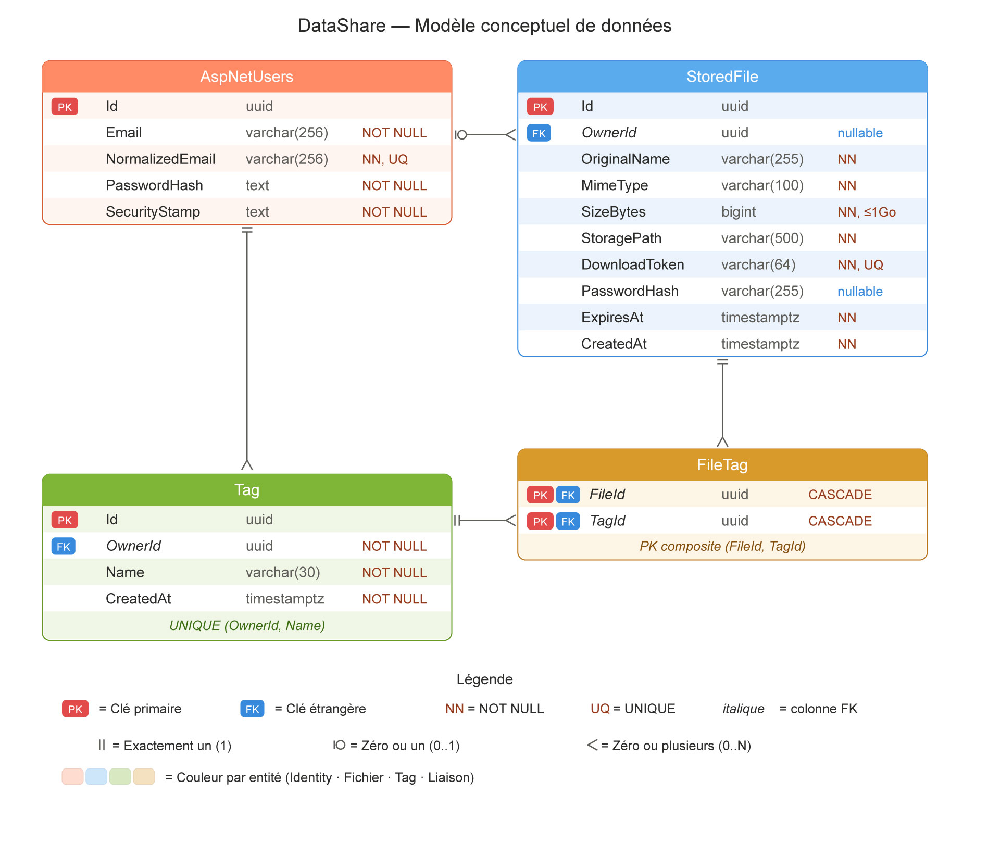

# DataShare — Modèle de données

> Ce document décrit le modèle de données de l'application DataShare. Il sert de source de vérité pour la couche persistance (Entity Framework Core sur PostgreSQL) et pour le contrat d'interface (`api/openapi.yaml`).

## 1. Vue d'ensemble

Le modèle est volontairement minimal pour rester aligné avec un MVP. Il couvre quatre concepts métier :

- **Utilisateur** — un compte enregistré, géré par ASP.NET Identity
- **Fichier stocké** (`StoredFile`) — un fichier téléversé par un utilisateur connecté ou anonyme, avec ses métadonnées et son token de téléchargement
- **Tag** — un libellé textuel libre, propre à un utilisateur, qu'on peut attacher à plusieurs fichiers
- **Association fichier-tag** (`FileTag`) — table de liaison N-N

## 2. Description des entités

### 2.1 `AspNetUsers` (utilisateur)

Table standard d'**ASP.NET Core Identity**. On utilise `IdentityUser<Guid>` sans extension custom pour le MVP — toutes les colonnes Identity par défaut suffisent (Email, NormalizedEmail, PasswordHash, SecurityStamp, etc.). Le hash de mot de passe est géré nativement par Identity (PBKDF2 avec sel aléatoire).

Pourquoi ne pas créer une table `User` custom ? Parce qu'Identity fournit gratuitement la vérification d'unicité de l'email, le hachage sécurisé, le `SecurityStamp` (utile pour l'invalidation de tokens) et tout l'écosystème de validators. Réinventer ces briques pour un MVP serait du temps perdu et augmenterait la surface d'erreur sécuritaire.

**Champs Identity utilisés** : `Id` (Guid), `Email`, `NormalizedEmail`, `PasswordHash`, `SecurityStamp`, `ConcurrencyStamp`. Le reste (téléphone, 2FA, lockout) reste en place mais n'est pas exploité par l'application.

### 2.2 `StoredFile`

Représente un fichier téléversé. Le nom `StoredFile` est choisi pour éviter le conflit avec le type `System.IO.File` côté C#.

Un `StoredFile` est lié à un utilisateur via `OwnerId`. Cette colonne est **nullable** : un fichier sans propriétaire correspond à un upload anonyme. Cette nullabilité est une décision structurante — elle évite d'avoir à créer une seconde table parallèle pour les uploads anonymes et garde toute la logique de stockage / téléchargement / expiration unifiée.

Les métadonnées portées par cette table permettent à l'API de répondre à plusieurs cas d'usage :

- **Téléchargement public** via `DownloadToken`, sans exposer l'`Id` interne
- **Historique connecté** via `OwnerId` + tri par `CreatedAt`
- **Suppression** avec vérification de l'`OwnerId`
- **Purge automatique** via `ExpiresAt` indexé
- **Protection par mot de passe** via `PasswordHash` nullable

### 2.3 `Tag`

Libellé court (≤ 30 caractères) défini librement par un utilisateur connecté pour organiser ses fichiers. Les tags sont **scopés à l'utilisateur** : chaque compte a son propre catalogue, indépendant des autres.

Justification du scoping : un tag « projet-x » dans le compte de Claire ne doit pas apparaître dans les suggestions de Marc. Le tag est une donnée privée. La contrainte unique `(OwnerId, Name)` garantit qu'un utilisateur n'a pas deux fois le même tag.

La création de tag est **implicite** lors de l'upload d'un fichier : si l'utilisateur saisit un tag inexistant, il est créé automatiquement et lié au fichier. Cette UX évite un endpoint « POST /api/tags » inutile.

### 2.4 `FileTag`

Table d'association N-N entre `StoredFile` et `Tag`. Clé composite `(FileId, TagId)`. Suppression en cascade des deux côtés : si on supprime un fichier ou un tag, les liens disparaissent automatiquement.

## 3. Dictionnaire des données

### 3.1 `AspNetUsers`

Table gérée par Identity. Voir la documentation officielle Microsoft pour le détail. Colonnes principales utilisées par DataShare :

| Colonne | Type | Contraintes | Description |
|---|---|---|---|
| `Id` | uuid | PK | Identifiant interne — généré côté serveur |
| `Email` | varchar(256) | not null | Adresse email saisie |
| `NormalizedEmail` | varchar(256) | not null, unique | Version normalisée pour la recherche d'unicité |
| `PasswordHash` | text | not null | Hash PBKDF2 + sel, géré par Identity |
| `SecurityStamp` | text | not null | Stamp invalidé en cas de changement de credentials |

### 3.2 `StoredFile`

| Colonne | Type | Contraintes | Description |
|---|---|---|---|
| `Id` | uuid | PK | Identifiant interne, généré côté serveur |
| `OwnerId` | uuid | FK → `AspNetUsers.Id`, nullable | NULL = upload anonyme |
| `OriginalName` | varchar(255) | not null | Nom du fichier d'origine, tel que reçu |
| `MimeType` | varchar(100) | not null | Type MIME détecté à l'upload |
| `SizeBytes` | bigint | not null, ≤ 1 073 741 824 | Taille en octets, max 1 Go (specs US01) |
| `StoragePath` | varchar(500) | not null | Chemin relatif du blob dans le volume `files-data` |
| `DownloadToken` | varchar(64) | not null, unique | Token cryptographiquement sûr, base64url, généré via `RandomNumberGenerator` (32 octets → 43 caractères) |
| `PasswordHash` | varchar(255) | nullable | Hash du mot de passe de protection, NULL si non protégé |
| `ExpiresAt` | timestamptz | not null | Date/heure absolue d'expiration (UTC) |
| `CreatedAt` | timestamptz | not null, default now() | Date/heure d'upload (UTC) |

**Index** :

| Index | Colonnes | Type | Justification |
|---|---|---|---|
| `IX_StoredFile_DownloadToken` | `DownloadToken` | Unique | Recherche systématique par token sur les routes publiques `/api/download/{token}` |
| `IX_StoredFile_OwnerId` | `OwnerId` | Standard | Construction de l'historique |
| `IX_StoredFile_ExpiresAt` | `ExpiresAt` | Standard | Scan horaire du `BackgroundService` de purge |

**Règles de gestion encodées** :

- `SizeBytes` ≤ 1 Go : validé côté API (FluentValidation) et côté front (Angular validators)
- `ExpiresAt` ≤ `CreatedAt` + 7 jours : validé à l'upload
- `PasswordHash` ≥ 6 caractères en clair avant hachage : validé sur le mot de passe en clair, pas sur le hash

### 3.3 `Tag`

| Colonne | Type | Contraintes | Description |
|---|---|---|---|
| `Id` | uuid | PK | |
| `OwnerId` | uuid | FK → `AspNetUsers.Id`, not null | Utilisateur propriétaire du tag |
| `Name` | varchar(30) | not null | Libellé libre, ≤ 30 caractères (specs US08) |
| `CreatedAt` | timestamptz | not null, default now() | |

**Contraintes** :

| Contrainte | Type | Justification |
|---|---|---|
| `UQ_Tag_OwnerId_Name` | Unique `(OwnerId, Name)` | Pas de doublon dans le catalogue d'un même utilisateur (specs US08) |

**Index** : `IX_Tag_OwnerId` (standard) — pour lister rapidement les tags d'un utilisateur.

### 3.4 `FileTag`

| Colonne | Type | Contraintes | Description |
|---|---|---|---|
| `FileId` | uuid | PK, FK → `StoredFile.Id`, on delete cascade | |
| `TagId` | uuid | PK, FK → `Tag.Id`, on delete cascade | |

Clé primaire composite `(FileId, TagId)`. Aucune autre colonne — table de liaison pure. Index implicite sur la PK couvre les deux directions de jointure.

## 4. Choix de modélisation justifiés

### 4.1 UUID plutôt qu'entier auto-incrémenté

Toutes les clés primaires sont en `uuid` (Guid côté .NET).

**Raisons** :

- Le `DownloadToken` est déjà cryptographiquement sûr, mais utiliser des UUID pour les `Id` internes évite tout risque d'énumération si on devait exposer un `Id` un jour (ex : `DELETE /api/files/{id}` — un `id` séquentiel laisserait deviner combien de fichiers existent dans le système)
- Génération côté application possible sans round-trip à la base
- Compatibles avec ASP.NET Identity qui supporte nativement `IdentityUser<Guid>`

**Compromis assumé** : les UUID prennent 16 octets contre 8 pour un bigint, et les index sont légèrement plus lourds. Négligeable à l'échelle d'un MVP.

### 4.2 Suppression physique (hard delete) plutôt que soft delete

La spécification US06 est explicite : « la suppression entraîne la suppression physique du fichier sur le système de stockage ainsi que de toutes ses métadonnées » et « la suppression est irréversible ». Idem pour US10 sur l'expiration. On respecte à la lettre — pas de colonne `DeletedAt`.

**Conséquence** : aucune trace en base après suppression. Les logs Serilog garderont une trace applicative (« file X deleted by user Y at T »), mais la base est nettoyée.

### 4.3 `OwnerId` nullable plutôt que table dédiée pour l'anonyme

Choix de garder une seule table `StoredFile` avec un `OwnerId` nullable, plutôt que de créer une table `AnonymousFile` parallèle.

**Avantages** :

- Une seule logique de stockage, de téléchargement, d'expiration et de purge
- Le `BackgroundService` de purge n'a qu'une seule table à scanner
- Les statistiques sont plus simples (« combien de fichiers actifs total »)

**Inconvénient assumé** : on perd la garantie SQL « un fichier connecté a forcément un owner ». Cette garantie est portée par la couche application (FluentValidation) : l'endpoint unique `POST /api/files` accepte l'authentification optionnelle et affecte `OwnerId` automatiquement selon la présence d'un JWT valide.

### 4.4 Tags scopés utilisateur plutôt que partagés

Choix justifié plus haut (§ 2.3). En complément : un modèle « tags partagés » (pool global) imposerait d'inventer une politique de modération (qui crée ? qui supprime ?), de gérer les conflits de noms et de polluer rapidement le catalogue. Hors-scope MVP.

## 5. Migration EF Core

La création initiale de la base sera faite via une migration EF Core (générée à l'étape 2 lors de l'init du socle technique). Stratégie :

- Migrations versionnées dans `backend/DataShare.Infrastructure/Migrations/`
- Nom de la migration initiale : `InitialCreate`
- Application au démarrage en environnement Development (auto-migrate) ; en production, appliquée explicitement via `dotnet ef database update` ou un script de déploiement

Le script SQL équivalent sera également produit (`scripts/init-db.sql`) pour les évaluateurs qui voudraient instancier la base sans passer par EF Core.

## 6. Traçabilité fonctionnelle

Vérification que chaque US du MVP a son support en base :

| US | Description | Tables / colonnes mobilisées |
|---|---|---|
| US01 | Upload connecté | `StoredFile` (toutes colonnes), `FileTag`, `Tag` |
| US02 | Download via lien | `StoredFile.DownloadToken`, `StoredFile.PasswordHash`, `StoredFile.ExpiresAt` |
| US03 | Création de compte | `AspNetUsers` (Identity) |
| US04 | Connexion | `AspNetUsers` (Identity) |
| US05 | Historique | `StoredFile.OwnerId`, `StoredFile.CreatedAt`, `StoredFile.ExpiresAt` (calcul `isExpired`) |
| US06 | Suppression | `StoredFile` DELETE physique + cascade `FileTag` |
| US07 | Upload anonyme | `StoredFile.OwnerId = NULL` |
| US08 | Tags | `Tag`, `FileTag`, contrainte unique `(OwnerId, Name)` |
| US09 | Mot de passe fichier | `StoredFile.PasswordHash` |
| US10 | Expiration auto | `StoredFile.ExpiresAt` + index, `BackgroundService` côté Application |
