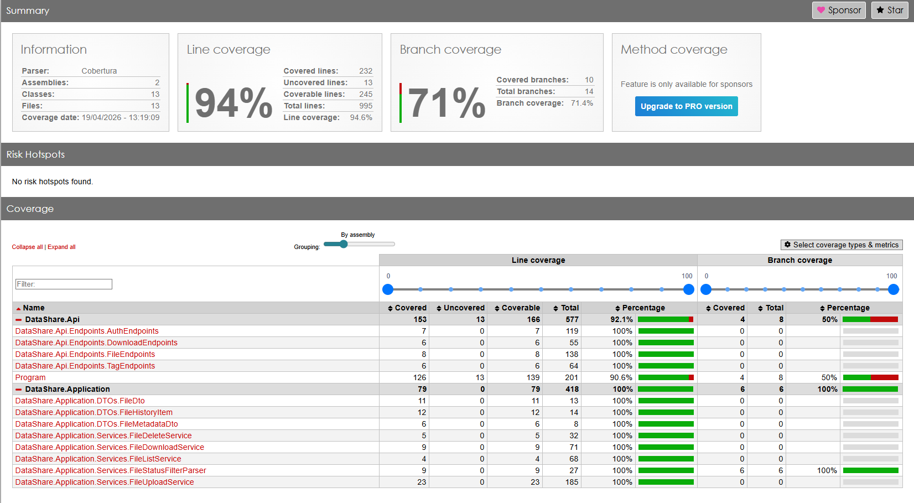
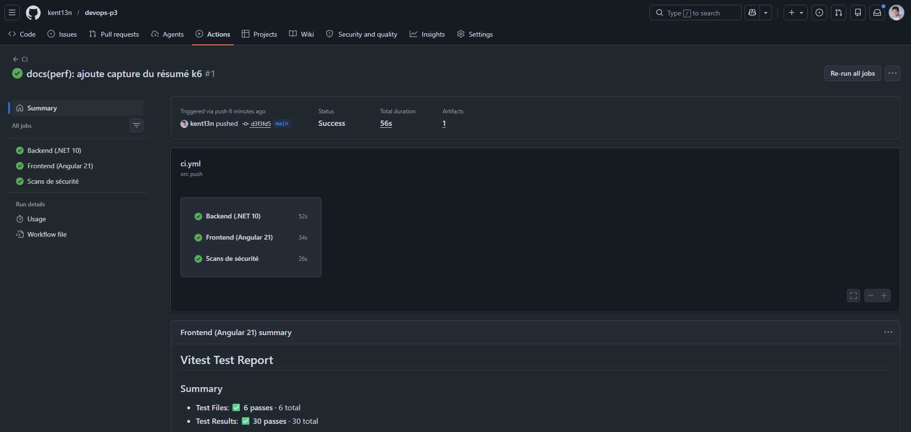
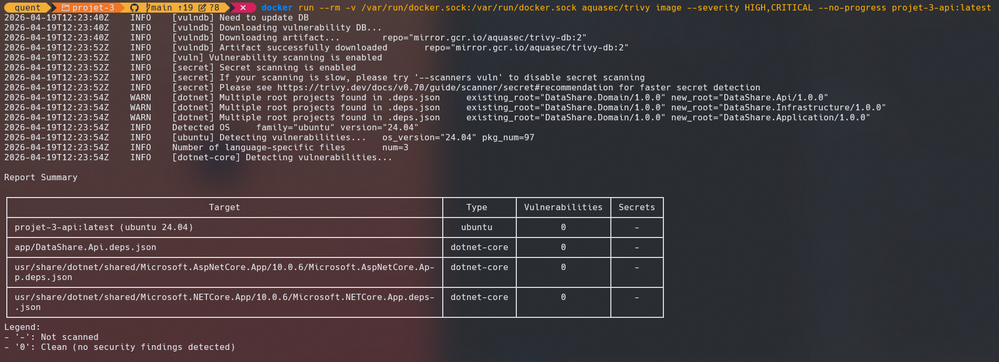
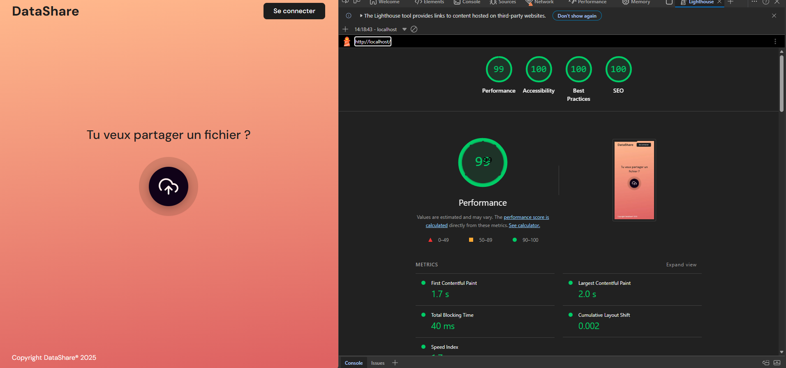

<!-- _paginate: false -->

# DataShare
### Partage de fichiers sécurisé

Projet 3 — Pilotage de développement complet
Kentin — 2026-04-19

---

## Contexte & mission

**Besoin** — Freelances et TPE doivent partager des fichiers avec leurs clients, sans passer par l'email (taille) ni par les grands acteurs cloud (confidentialité).

**Périmètre MVP** — Upload anonyme ou connecté, lien de téléchargement temporaire, protection par mot de passe, historique utilisateur.

**Contrainte** — 4 semaines, démo investisseurs.

**Stack imposée** — Web fullstack + conteneurisé + base relationnelle.

---

<!-- _class: dense-table -->

## User stories livrées

<style scoped>
  table { font-size: 0.65em; margin: 0 auto; }
  td, th { padding: 4px 8px; }
  p:last-of-type { text-align: center; margin-top: .5em; }
</style>

| ID | Story | Statut |
|---|---|---|
| US01 | Upload anonyme avec expiration et mdp | ✅ |
| US02 | Download via lien temporaire | ✅ |
| US03 | Inscription utilisateur | ✅ |
| US04 | Connexion utilisateur | ✅ |
| US05 | Historique des fichiers (**déléguée à l'IA**) | ✅ |
| US06 | Suppression d'un fichier par son propriétaire | ✅ |
| US07 | Upload anonyme sans inscription | ✅ |
| US08 | Tags sur les fichiers (utilisateurs connectés) | ✅ |
| US09 | Protection par mdp | ✅ |
| US10 | Expiration automatique (1–7 jours) | ✅ |

**6 US obligatoires + 3 optionnelles livrées.**

---

## Stack technique

<style scoped>
  table { font-size: 0.7em; margin: 0 auto; }
  td, th { padding: 6px 10px; }
</style>

| Couche | Techno | Pourquoi |
|---|---|---|
| Backend | **.NET 10** + Minimal API | Écosystème mature, perf, Clean Archi native |
| Frontend | **Angular 21** + Material + Tailwind | Signals, OnPush, standalone components |
| Base | **PostgreSQL 16** | ACID, contraintes uniques, indexes composites |
| Auth | **ASP.NET Identity + JWT** | Stateless, horizontalement scalable |
| Conteneurs | **Docker Compose** | 3 services, reproductibilité from scratch |
| Tests | xUnit, AwesomeAssertions, Testcontainers, Vitest, Playwright | Pyramide complète |

---

## Architecture Clean

<style scoped>
  pre { font-size: 0.6em; margin: 0 auto; }
</style>

```
┌─────────────────┐
│   DataShare.Api │   Endpoints (Minimal API), DI, middleware
└────────┬────────┘
         │ dépend de
┌────────▼──────────────────┐
│ DataShare.Application     │   Services métier, DTOs, interfaces
└────────┬──────────────────┘   (aucune dépendance infra)
         │ dépend de
┌────────▼─────────┐
│ DataShare.Domain │   Entités + règles métier pures
└──────────────────┘
         ▲
         │ implémente les interfaces
┌────────┴──────────────────────┐
│ DataShare.Infrastructure      │   EF Core, Identity, JWT,
└───────────────────────────────┘   stockage fichiers, BG services
```

Les dépendances pointent **toujours vers Domain**. Application ne connaît pas EF Core — seulement `IApplicationDbContext`.

---

## Modèle de données

<style scoped>
  .cols { display: flex; gap: 2em; align-items: flex-start; }
  .cols > div:first-child { flex: 1.3; }
  .cols > div:last-child { flex: 1; font-size: 0.9em; }
  .cols img { max-width: 90%; height: auto; display: block; margin: 0 auto; }
</style>

<div class="cols">
<div>


</div>
<div>

**4 entités principales** :

- `AspNetUsers` (Identity)
- `StoredFiles`
- `Tags`
- `FileTags` (pivot N-N, tag par owner)

**Soft-delete** par flag `IsPurged` + `ExpiresAt`.

</div>
</div>

---

## Déploiement Docker

<style scoped>
  .cols { display: flex; gap: 2em; align-items: flex-start; }
  .cols > div:first-child { flex: 1; }
  .cols > div:last-child { flex: 1.2; font-size: 0.9em; }
  .cols img { max-width: 100%; max-height: 440px; height: auto; width: auto; display: block; margin: 0 auto; }
</style>

<div class="cols">
<div>


</div>
<div>

**3 services sur le réseau `datashare`** :

- **web** (nginx + Angular build) — reverse proxy sur `/api/`
- **api** (.NET 10) — métier + stockage
- **db** (Postgres 16) — persistance

**Volumes** : `db-data` (Postgres) et `files-data` (blobs).

**Démarrage** en une commande : `docker compose up --build`.

</div>
</div>

---

<!-- Démo live entre ce slide et le suivant : 3-5 min -->
<!-- 1. Upload anonyme → copie du lien -->
<!-- 2. Ouverture du lien dans nouvel onglet → download -->
<!-- 3. Inscription + connexion → espace "Mes fichiers" -->
<!-- 4. Filtre actif/expiré, suppression optimiste -->

## Tests — pyramide

<div class="metric">116 tests verts · 100 %</div>

| Niveau | Nombre | Outils |
|---|---|---|
| Unitaires backend | **60** | xUnit + AwesomeAssertions + NSubstitute + MockQueryable |
| Intégration backend | **23** | WebApplicationFactory + Testcontainers (Postgres réel) |
| Unitaires frontend | **30** | Vitest + jsdom + Angular TestBed |
| E2E | **3** | Playwright + Chromium |

Scénarios E2E : inscription/connexion/logout, upload+download connecté, upload protégé+download.

---

## Qualité en CI

<style scoped>
  .cols { display: flex; gap: 2em; align-items: center; }
  .cols > div:first-child { flex: 1; display: flex; flex-direction: column; gap: 0.6em; }
  .cols > div:last-child { flex: 1; font-size: 0.85em; }
  .cols img { max-width: 100%; max-height: 210px; width: auto; height: auto; display: block; margin: 0 auto; }
  .metric { font-size: 1.4em; color: #BA681F; font-weight: 700; margin-bottom: 0.4em; }
</style>

<div class="cols">
<div>





</div>
<div>

<div class="metric">Couverture 94 %</div>

- **Filtrée** sur `DataShare.Application` (100 %) + `DataShare.Api` (92 %) — périmètre métier + endpoints
- **Gate automatique** dans le workflow GitHub Actions : build rouge si couverture < 70 %
- 3 jobs parallèles : backend, frontend, scans sécurité

</div>
</div>

---

## Sécurité & Performance

<style scoped>
  .cols { display: flex; gap: 2em; align-items: center; }
  .cols > div:first-child { flex: 1; display: flex; flex-direction: column; gap: 0.6em; }
  .cols > div:last-child { flex: 1.3; font-size: 0.7em; }
  .cols img { max-width: 100%; max-height: 210px; width: auto; height: auto; display: block; margin: 0 auto; }
  .cols table { font-size: 1em; margin: 0 0 0.8em 0; }
  .cols td, .cols th { padding: 3px 6px; }
</style>

<div class="cols">
<div>





</div>
<div>

| Axe | Mesure | Cible | Résultat |
|---|---|---|---|
| Trivy image API | HIGH + CRITICAL | 0 | **0** |
| Trivy image web | HIGH + CRITICAL | 0 | **0** |
| `dotnet list --vulnerable` | toutes sévérités | 0 | **0** |
| `npm audit` | HIGH + | 0 | **0** |
| Lighthouse mobile | Perf / A11y / BP / SEO | ≥ 80 | **98 / 100 / 100 / 100** |
| k6 (10 VUs, 2 min) | p95 latence | < 2 s | **14 ms** |

Mesures : BCrypt, PBKDF2 Identity, JWT HS256, rate limiter par IP, anti-IDOR (404 indiscernable), validation d'extension, `X-Content-Type-Options: nosniff`.

</div>
</div>

---

## Workflow IA (US05)

<style scoped>
  p, ul { margin: 0.4em 0; font-size: 0.92em; }
  li { margin: 0.2em 0; }
</style>

**Pourquoi US05** — périmètre clair, auto-contenu, UI riche, non-critique pour la démo si l'IA échoue.

**3 commits IA** ([6fdbcb7](https://github.com/kent13n/devops-p3/commit/6fdbcb7), [c9e1ef6](https://github.com/kent13n/devops-p3/commit/c9e1ef6), [9326dda](https://github.com/kent13n/devops-p3/commit/9326dda)) → backend soft-delete + endpoint + page Angular.

**2 commits fix humains** ([e0f00f8](https://github.com/kent13n/devops-p3/commit/e0f00f8), [72e1191](https://github.com/kent13n/devops-p3/commit/72e1191)) → race condition détachement tag, parser numérique rejeté, index composite, design Figma, a11y.

**Retour d'expérience** :
- ✅ Structure Clean Archi respectée spontanément
- ⚠️ Edge cases d'inputs et race conditions nécessitent une relecture systématique
- ⚠️ Pas de vision transverse (anti-IDOR, perf) — humain indispensable

---

## Conclusion & roadmap

<style scoped>
  p, ul, ol { margin: 0.3em 0; font-size: 0.85em; }
  li { margin: 0.15em 0; }
</style>

**Atteint** — MVP complet, 6/6 US obligatoires + 3 optionnelles, couverture 94 %, CI + gate, Lighthouse 98, Trivy 0/0, documentation exhaustive (TESTING, SECURITY, PERF, MAINTENANCE, 04-utilisation-ia).

**Limites MVP assumées** — pas de refresh token, pas de 2FA, JWT en `localStorage`, stockage non chiffré au repos, pas d'antivirus upload (documenté dans SECURITY.md).

**Roadmap post-MVP** (par impact estimé) :
1. Chiffrement au repos des blobs (AES-256 + KMS)
2. 2FA TOTP + rotation automatique des secrets
3. Antivirus ClamAV sur upload
4. Compression Brotli + HTTP/2 (nécessite TLS)
5. Tests de mutation (Stryker) + OWASP ZAP baseline en CI

Merci pour votre attention — questions ?
